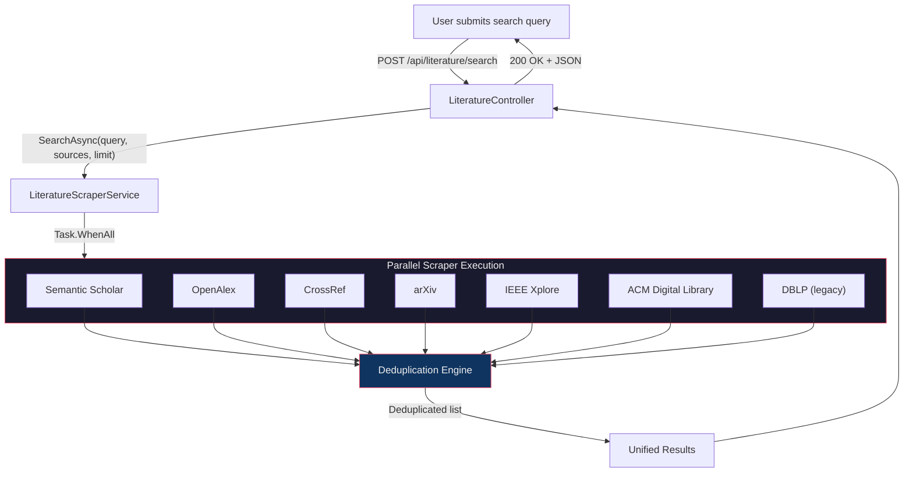
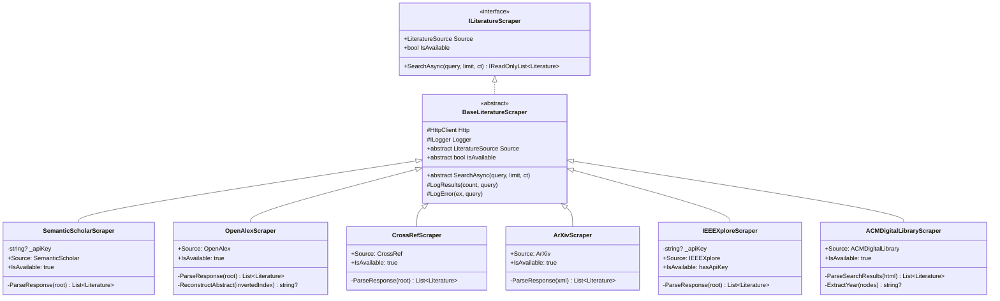
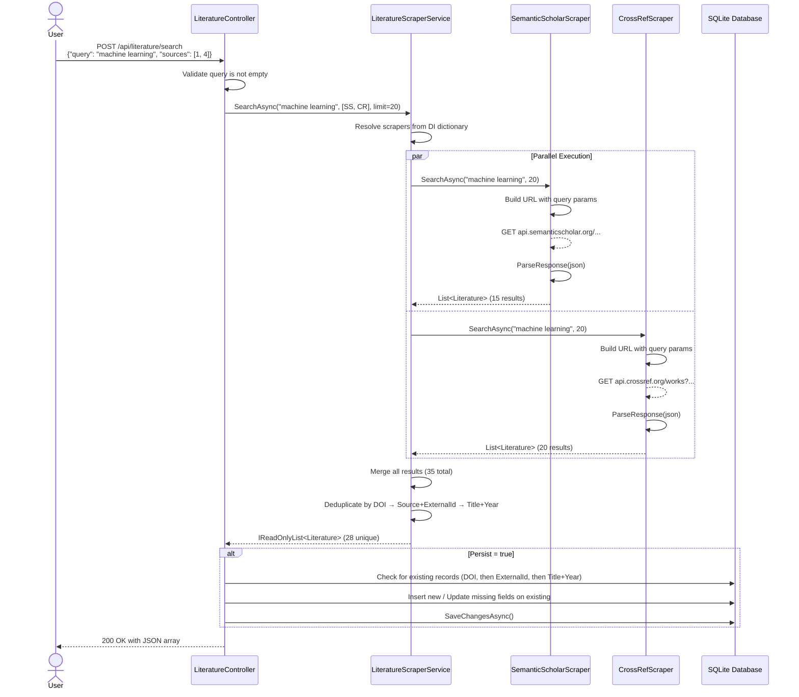
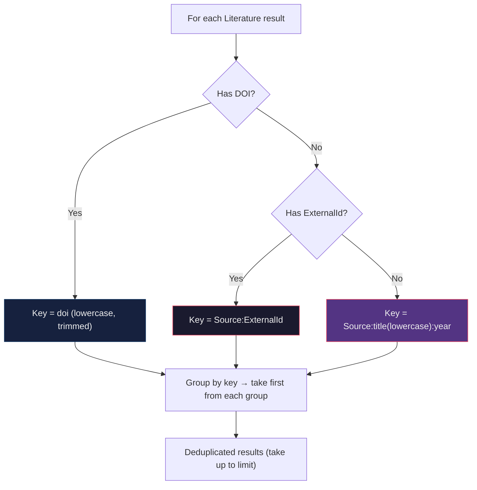
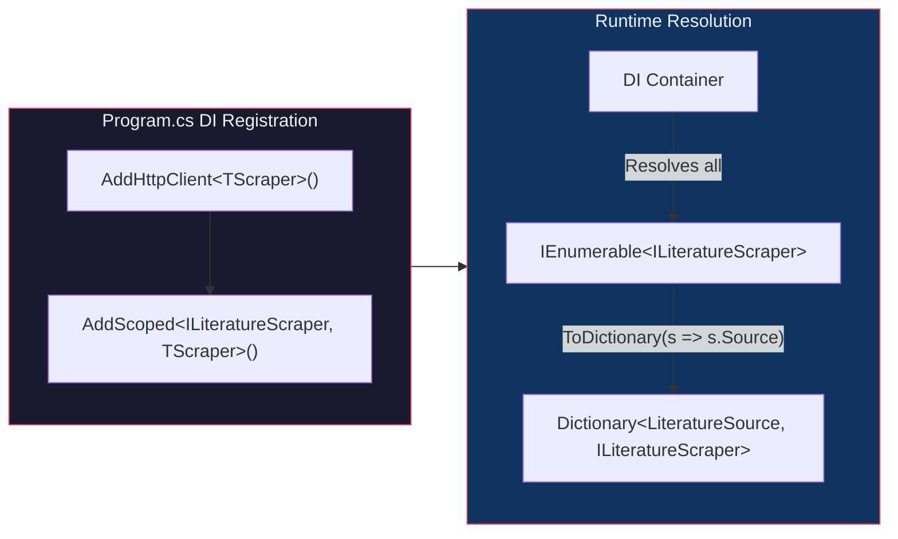
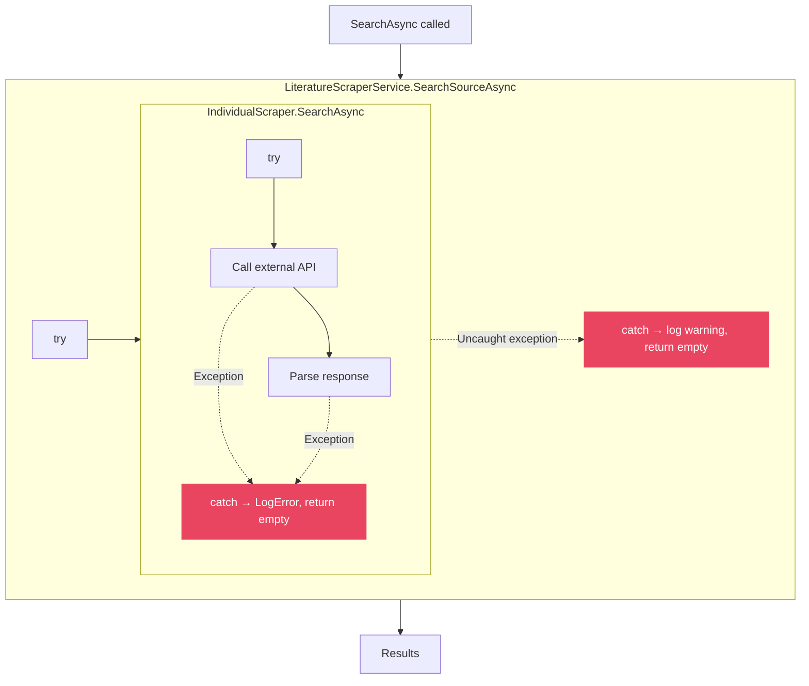

# Literature Scraper Architecture

This document explains how the DIP Backend searches across multiple academic databases using a modular scraper pattern.

## High-Level Overview

DIP aggregates search results from **7 academic sources** using a single query. Each source has its own scraper class that knows how to talk to that source's API, parse the response, and return a unified `Literature` object. The orchestrator (`LiteratureScraperService`) runs all selected scrapers **in parallel**, then **deduplicates** the combined results.



## Class Hierarchy

The scraper system uses a classic **Strategy + Template Method** pattern. Each scraper implements a common interface, but the base class provides shared infrastructure (HTTP client config, logging helpers).



## Request Flow (Sequence Diagram)

This shows what happens when a user searches for "machine learning" across Semantic Scholar and CrossRef:



## The `Literature` Model

Every scraper maps its source-specific response into this unified model:

| Field | Type | Description |
|-------|------|-------------|
| `Title` | `string` (required) | Paper title |
| `Abstract` | `string?` | Paper abstract/summary |
| `Doi` | `string?` | Digital Object Identifier (primary dedup key) |
| `Url` | `string?` | Link to the paper's landing page |
| `PdfUrl` | `string?` | Direct link to PDF if available |
| `Year` | `string?` | Publication year |
| `Authors` | `string?` | Comma-separated author names |
| `Source` | `LiteratureSource` | Which database this came from (enum) |
| `ExternalId` | `string?` | Source-specific unique identifier |

## Deduplication Strategy

When results come back from multiple sources, the same paper might appear more than once. The deduplication uses a **3-tier priority**:



**Why this order?**
- **DOI** is the most reliable cross-source identifier. A paper found in both Semantic Scholar and CrossRef will share the same DOI.
- **Source + ExternalId** catches duplicates within the same source (e.g., two OpenAlex results with the same OpenAlex ID).
- **Title + Year** is a last-resort fuzzy match for papers that lack DOI and ExternalId.

## Per-Scraper Details

### 1. Semantic Scholar (`SemanticScholarScraper`)

| Property | Value |
|----------|-------|
| Enum | `LiteratureSource.SemanticScholar` (1) |
| API | REST JSON (free, optional API key for higher rate limits) |
| Endpoint | `https://api.semanticscholar.org/graph/v1/paper/search` |
| Auth | Optional `x-api-key` header |
| Availability | Always (`IsAvailable = true`) |

**How it works:**
- Sends a GET request with `query`, `limit`, and `fields` parameters
- If an API key is configured in `appsettings.Secrets.json`, adds the `x-api-key` header for higher rate limits
- Parses the `data` array from the JSON response
- Extracts DOI from the `externalIds.DOI` nested field
- Gets PDF URL from `openAccessPdf.url`

### 2. OpenAlex (`OpenAlexScraper`)

| Property | Value |
|----------|-------|
| Enum | `LiteratureSource.OpenAlex` (3) |
| API | REST JSON (completely free, no key needed) |
| Endpoint | `https://api.openalex.org/works` |
| Auth | None |
| Availability | Always (`IsAvailable = true`) |

**How it works:**
- Sends a GET request with `search` and `per_page` parameters
- Parses the `results` array from the JSON response
- **Unique feature:** OpenAlex stores abstracts as an **inverted index** (`abstract_inverted_index`), not plain text. The `ReconstructAbstract()` method rebuilds the original text by sorting word positions:
  ```json
  {"Machine": [0], "learning": [1], "is": [2], "great": [3]}
  → "Machine learning is great"
  ```
- DOI comes prefixed with `https://doi.org/` — the scraper strips this prefix
- Gets open access PDF from `open_access.oa_url`

### 3. CrossRef (`CrossRefScraper`)

| Property | Value |
|----------|-------|
| Enum | `LiteratureSource.CrossRef` (4) |
| API | REST JSON (free, polite pool with email in User-Agent) |
| Endpoint | `https://api.crossref.org/works` |
| Auth | None (User-Agent email gives higher rate limits) |
| Availability | Always (`IsAvailable = true`) |

**How it works:**
- Sends a GET request with `query` and `rows` parameters
- Parses `message.items` array from the JSON response
- **Year extraction** is complex: tries `published-print.date-parts` first, then falls back to `published-online.date-parts`. Date parts are nested arrays: `[[2023, 5, 15]]` → year = 2023
- Authors come as objects with `given` and `family` name fields
- Looks for PDF links in the `link` array where `content-type` contains "pdf"

### 4. arXiv (`ArXivScraper`)

| Property | Value |
|----------|-------|
| Enum | `LiteratureSource.ArXiv` (5) |
| API | Atom XML (free, aggressive rate limiting ~1 req/3s) |
| Endpoint | `https://export.arxiv.org/api/query` |
| Auth | None |
| Availability | Always (`IsAvailable = true`) |

**How it works:**
- Sends a GET request with `search_query=all:...` and `max_results` parameters
- **Only XML-based scraper** — uses `System.Xml.Linq` (XDocument) instead of JSON
- Parses Atom `<entry>` elements within the `http://www.w3.org/2005/Atom` namespace
- Extracts arXiv ID from the entry `<id>` URL (e.g., `http://arxiv.org/abs/2301.12345` → `2301.12345`)
- DOI comes from the `http://arxiv.org/schemas/atom` namespace
- PDF link found via `<link title="pdf" href="..."/>`
- **Caveat:** arXiv enforces strict rate limiting (HTTP 429). Repeated requests within a few seconds will fail.

### 5. IEEE Xplore (`IEEEXploreScraper`)

| Property | Value |
|----------|-------|
| Enum | `LiteratureSource.IEEEXplore` (10) |
| API | REST JSON (requires API key) |
| Endpoint | `https://ieeexploreapi.ieee.org/api/v1/search/articles` |
| Auth | API key in query string (`apikey=...`) |
| Availability | Only if API key is configured (`IsAvailable = hasApiKey`) |

**How it works:**
- Checks `IsAvailable` before searching — returns empty if no API key
- API key comes from `LiteratureApiKeysOptions.IEEEXplore` (bound from `appsettings.Secrets.json`)
- Parses the `articles` array from the JSON response
- **Author structure** is nested: `authors.authors[]` (double nesting)
- `publication_year` can be either a JSON number or string — handles both
- Constructs fallback URL from article number if `html_url` is missing

### 6. ACM Digital Library (`ACMDigitalLibraryScraper`)

| Property | Value |
|----------|-------|
| Enum | `LiteratureSource.ACMDigitalLibrary` (11) |
| API | HTML scraping (no public API) |
| Endpoint | `https://dl.acm.org/action/doSearch` |
| Auth | None (browser-like headers) |
| Availability | Always (`IsAvailable = true`) |

**How it works:**
- **Only HTML scraper** — uses HtmlAgilityPack instead of JSON/XML parsers
- Establishes a session first by visiting `https://dl.acm.org/` (cookies required)
- Overrides default headers to look like a browser (User-Agent, Accept, Sec-Fetch headers)
- HttpClient is configured with `UseCookies = true` and `AllowAutoRedirect = true` in `Program.cs`
- Parses `<li class="search__item">` elements for each result
- Extracts DOI from the href pattern `/doi/10.1145/...`
- Year is found by regex-matching 4-digit years in `dot-separator` spans
- **Caveat:** ACM may block automated access after repeated requests.

### 7. DBLP (Legacy — Not Migrated)

| Property | Value |
|----------|-------|
| Enum | `LiteratureSource.DBLP` (2) |
| API | REST JSON (free) |
| Endpoint | `https://dblp.org/search/publ/api` |
| Status | **Marked `[Obsolete]`** — DBLP service is currently down |

DBLP is the only scraper still implemented as a private method inside `LiteratureScraperService.cs`. It's kept as a fallback in the switch statement but marked as obsolete. It won't be migrated until the DBLP service comes back online.

## Dependency Injection Registration

Each scraper is registered in `Program.cs` with two lines:



**Why `AddHttpClient<T>()`?** This gives each scraper its **own `HttpClient` instance** managed by ASP.NET Core's `IHttpClientFactory`. Benefits:
- Automatic DNS refresh (avoids stale DNS issues on long-running servers)
- Connection pooling per scraper
- Per-scraper HttpClient configuration (ACM needs cookies/browser headers, others don't)

**Why `AddScoped<ILiteratureScraper, T>()`?** All scrapers register against the same `ILiteratureScraper` interface. ASP.NET Core's DI collects them into `IEnumerable<ILiteratureScraper>`, which the orchestrator converts to a dictionary keyed by `LiteratureSource` enum for O(1) lookup.

## Error Isolation

Each scraper is wrapped in a try/catch at **two levels**:

1. **Inside the scraper** — `SearchAsync` catches exceptions and returns `Array.Empty<Literature>()`
2. **Inside the orchestrator** — `SearchSourceAsync` also catches exceptions as a safety net

This means if one source is down (like arXiv rate-limiting), the other sources still return results. The user gets partial results rather than a complete failure.



## Adding a New Scraper

To add a new source (e.g., SpringerLink), follow these steps:

1. **Add enum value** to `Models/LiteratureSource.cs`:
   ```csharp
   SpringerLink = 13,
   ```

2. **Create scraper class** in `Services/Scrapers/SpringerLinkScraper.cs`:
   ```csharp
   public class SpringerLinkScraper : BaseLiteratureScraper
   {
       public override LiteratureSource Source => LiteratureSource.SpringerLink;
       public override bool IsAvailable => !string.IsNullOrWhiteSpace(_apiKey);

       public SpringerLinkScraper(HttpClient http, ILogger<SpringerLinkScraper> logger,
           IOptions<LiteratureApiKeysOptions> apiKeysOptions) : base(http, logger)
       {
           _apiKey = apiKeysOptions.Value.SpringerLink;
       }

       public override async Task<IReadOnlyList<Literature>> SearchAsync(
           string query, int limit, CancellationToken ct = default)
       {
           // Call API, parse response, return List<Literature>
       }
   }
   ```

3. **Register in `Program.cs`**:
   ```csharp
   builder.Services.AddHttpClient<SpringerLinkScraper>();
   builder.Services.AddScoped<ILiteratureScraper, SpringerLinkScraper>();
   ```

4. **If API key needed**, add to `LiteratureApiKeysOptions` and `appsettings.Secrets.json`

That's it. The orchestrator will automatically discover the new scraper via `IEnumerable<ILiteratureScraper>` — **no changes needed** to `LiteratureScraperService` or `LiteratureController`.
